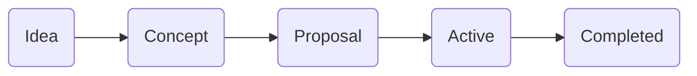

# Bitcoin Design Projects

We need a system that allows us to organize and communicate active design projects. The system should make it easy for someone to quickly glance at active projects and be able to participate in a project of interest without wading through irrelevant discussion. The system should also be as decentralized as possible, allowing anyone to formulate an idea, turn it into a concept, then a proposal, and begin working on it.

This document is about larger contributions to Bitcoin Design that may involve multiple contributors over days, weeks, and months. Smaller requests and improvements (fixing typos, updating an image, bugs) can more simply get handled via issues.

An active project board can be used to help organize these efforts. We are proposing that this could live on a community Github account, but before that is set up this doc is meant to be an overview of what is being worked on.

This is an early doc with a list of active projects, how to initiate one and how to run a project once live. These are proposals and can be adjusted as needed based on feedback. Please be vocal about your concerns.

## Project Life Cycle

Many projects start as simple ideas and grow over time with the help of many different people. Ideas can be about new chapters to the guide, new work groups, research projects, software to be developed, contributions to other projects, and more.

### 1. Idea

- Formulate your idea and discuss it on Slack (#project-ideas) to get feedback
- References, prototypes, sketches and other materials that help explain the idea are great for communicating clearly
- An idea does not have to be so specific that the outcome is clear

### 2. Concept

- A more mature idea can be posted as an issue on GitHub (in the most appropriate repository and project board) after some discussion
- We may want to create an issue template to help people enter at least the minimum information needed for others to understand and evaluate the concept
- The concept can be fleshed out further in the comment thread of the issue
- The issue becomes the central place for the concept (unlike Slack where things get lost in the feed)

### 3. Proposal

- Goal of a proposal is to decide what to practically do about it, turning a concept into a plan
- Anybody can turn a concept into a proposal if they feel it is worthwhile to continue with it

### 4. Active Project

- A proposal becomes an active project once there is enough support and people actively start working on it
- If the project is related to the code on GitHub, a branch or fork can be created for the work to be executed
- If needed, a new repository and/or project board can be set up

### 5. Completed project

- If the project is in a branch or fork, a pull request is created
- This pull request needs to be reviewed
  - Support and concerns are shown via comments that contain our approval term (ACK, W, thumbs up, etc) or disapproval term (NACK, L, thumbs down, etc) and a rationale. 
  - Comments are primarily weighted based on the strength of the rationale, but may also be weighted based on expertise, commitment and consistency of the commenter to the project.
  - Concerns need to be adequately addressed (note this is different than resolved) by participants before moving forward.
- A rough consensus should be reached before continuing
  - For a thoughtful explanation of rough consensus, please [read this](https://tools.ietf.org/html/rfc7282).
- On completion, the pull requests is merged and closed, along with the issue
  - Need to decide initial group of maintainers with merge access, [join the discussion](https://github.com/BitcoinDesign/Meta/issues/10)

## Project ideas

Just a few ideas of things we can try to do or get involved in. This is in no way comprehensive - if you want to see what else is being worked on .

- Open-source bitcoin projects that really need design work done ([BTCPay](https://bitcoindesign.slack.com/archives/C015GFYSJNA/p1593278999208700?thread_ts=1593109196.175100&cid=C015GFYSJNA), [Bitcoin Core](https://bitcoindesign.slack.com/archives/C016Y1XFR99), [Photon Wallet](https://github.com/photon-sdk/photon-lib))
- Bitcoin design podcast ([via Pedro](https://bitcoinopuxui.com))
- Wallet UI kit
- Regular design review calls (in addition to community calls, these would be solely for reviewing 
  active design work or products)
- Work groups (research, community, open design…)
- Bitcoin design swag (shirts, stickers, posters…)
- Larger bitcoin community involvement (participation in external events like conferences, podcasts, workshops, meetups or writing blog posts and other content)
- User research templates so anyone in the ecosystem can easily perform research ([Slack convo](https://bitcoindesign.slack.com/archives/C015DQEPCHJ/p1594844380182400))
- Font support for the bitcoin symbol ([Slack conversation about Inter](https://bitcoindesign.slack.com/archives/C015856BDME/p1594756418462500))
- Contribute to the [Bitcoin wiki](https://en.bitcoin.it/wiki/Main_Page)
---

###### Flow Chart Source

